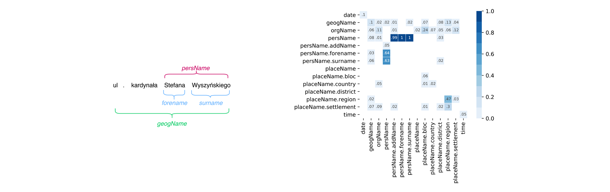

Code and Data Accompanying the Paper "Approaching nested named entity recognition with parallel LSTM-CRFs"
=======================
This repository offers code and data to replicate the best solution underlying the paper: Borchmann, Łukasz; Gretkowski, Andrzej; Graliński, Filip. _Approaching nested named entity recognition with parallel LSTM-CRFs_. Ogrodniczuk, Maciej; Kobyliński, Łukasz (Ed.): _Proceedings of the PolEval 2018 Workshop_, pp. 63-73, Institute of Computer Science, Polish Academy of Science, Warszawa, 2018.

\[[PDF](http://www.borchmann.pl/wp-content/uploads/2018/10/borchmann-lukasz.pdf), [BibTeX](ref.bib)\]

General information
-------------------
PolEval is an example of nested named entity recognition tasks, where it is expected that named entities can overlap and contain other named entities. The specific distribution of entities in the National Corpus of Polish encouraged us to handle the problem in a following way: to train separate, classic BiLSTM-CRF models per (almost) non-overlaping entity groups, that is groups guaranteeing it is at least highly unlikely entities within will collide. Whenever possible, groups consisted of neighboring entities in order to exploit the potential of linear CRF chain.

_**Figure** on the right presents overlaps of named entities within 1M subcorpus of the National Corpus of Polish. Values were calculated as frequency of both labels overlaps to the frequency of vertical label._

GloVe and Contextual String Embeddigns were used. The latter were recently proposed by [Akbik et al. (2018)](http://alanakbik.github.io/papers/coling2018.pdf), who showed that the internal states of a trained character language model can be used to create word embeddings able to outperform the previous state-of-the-art in sequence labeling tasks.

Forward and backward character-level language models were trained on 1B words corpus of Polish composed in one third of respectively subsamples from: Polish Wikipedia, PolEval's language modeling task (supposably the National Corpus of Polish) and Polish Common Crawl. Subsamples of Wikipedia and PolEval tasks were selected randomly, whereas from Common Crawl those sentences were selected, which were characterized with the highest similarity to PolEval sample, as expressed with cross-entropy.

The final LSTM-CRF sequence labelling models were trained with one bidirectional LSTM layer and 512 hidden states on 300-dimensional GloVe embeddings, as well as embeddings from forward and backward LMs with 2048 hidden states, utilizing the [flair framework](https://github.com/zalandoresearch/flair).

Before you start
-------------------

Run `make prepare` in order to install all the required Python packages, to download PolEval's test set, and to download and decompress the 1M subcorpus of the National Corpus Of Polish, as well as to convert it to our internal format. The mentioned consists of two tab-separated values (one sentence is stored in one line):

| **Sequence of words (space-separated)** | **Labels with indexes** |
|-|-|
| Mszą świętą zakończyły się w niedzielę Jasnogórskie Dożynki 2001 | geogName:7 date:9 |
| Premier Jerzy Buzek zapewniał rolników | persName:2,3 persName\_forename:2 persName\_surname:3 |

Tokenization is NKJP-compatible, thus one should expect orthographic words tokenized into subword unists, such as _miałam_ &rarr; _miała_ _m_. A more detailed description can be found [here](http://nkjp.pl/settings/papers/NKJP_ksiazka.pdf).

Training the sequence taggers
-------------------
Type `make models` to train sequence taggers models per non-overlapping entity groups, as defined in _ne\_groups.py_. Models after 40 epochs, as well as ones best performing on dev set will be stored.

All the required language models and GloVe embeddings we trained are downloaded automagically during the scripts execution.

Tagging PolEval's test set
-------------------

PolEval's test set is not tokenized and thus requires some preprocessing to be handled by the system described above. This part is tricky since it requires a tremendous effort to succesfully install [toki tokenizer](http://nlp.pwr.wroc.pl/redmine/projects/toki/wiki) (which has NKJP-like tokenization rules implemented) and the process is a little bit hackish on up-to-date Linux distributions. Due to that we are providing output tokenized by us using the `toki-app -q -n -c nkjp --orth` command in _data/test.tsv_ file.

Run `make predict` to create PolEval-compatible output file in _data/out.json_ and `make evaluate` to get the final task scores.
